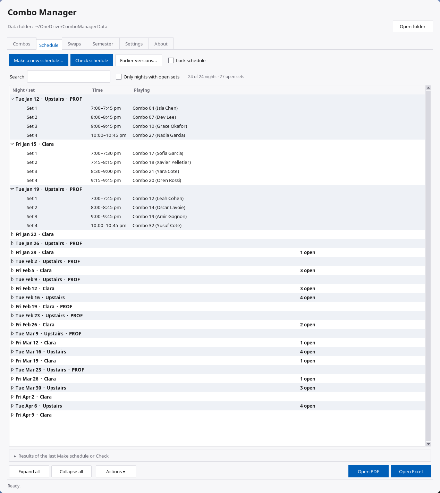
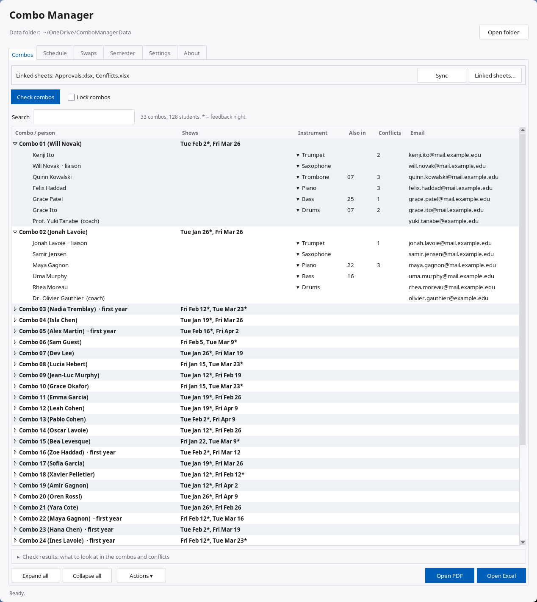
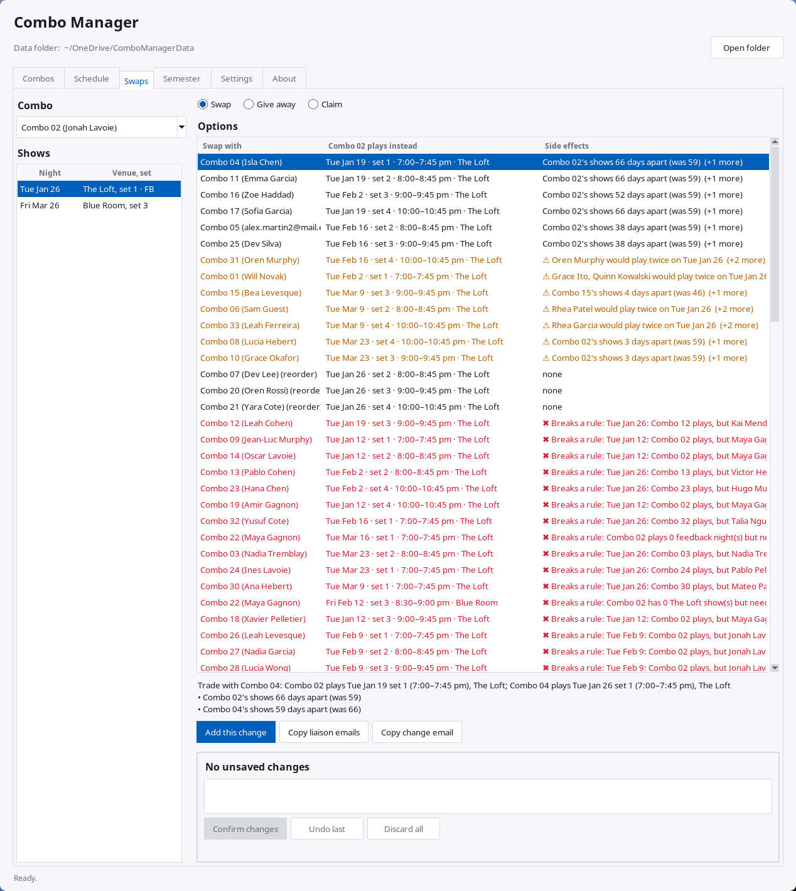

# Combo Manager

Makes the semester's combo show calendar and handles swaps during the semester.

**How to use it: see `Quick Start.pdf`.**

| Combos | Swaps |
|---|---|
|  |  |

*The screenshots use made-up data: the names, emails and venues are fake.*

## What it does

- **Combos:** brings in the approved sign-ups and conflicts from the forms, or lets you add them by hand. Add or
  remove members, change the liaison, fix names and emails, set instruments, mark first-year combos, withdraw a
  combo. **Check combos** points out problems before the schedule is made, and **Check this combo** says whether
  a combo waiting for a decision would fit, before you approve it.
- **Schedule:** makes the whole semester in about a minute. Every combo gets its shows, never on a night one of its
  members can't make, with feedback nights (a faculty member attends), first-year combos starting later, and shows spread out. Exports a
  calendar PDF and an Excel file, ready to send.
- **Swaps:** when a combo can't make a show, lists every possible trade or move, best first, and warns about side
  effects. Also handles giving a show away and claiming an open set. Copies a ready-to-send email for the liaisons.
- **Safe changes:** nothing is saved until **Confirm changes**. **Earlier versions** brings back the schedule as it
  was before any change, and **Lock schedule** stops it being remade by accident.
- **Semester:** the dates, show nights, venues and rules, each explained in the app.
- **Emails:** copy the liaisons' or everyone's emails for a night or a combo, ready to paste into Outlook.

## How the schedule is made

The schedule isn't built by hand-written rules of thumb: it's solved as an **optimization problem**. The app
describes every possible way to place the combos on the show nights, the rules each one must follow, and what makes
one schedule better than another. A solver (Google's OR-Tools) then searches all of them for the best one. The same input
always gives the same schedule.

Under most circumstances, this gives the best schedule possible. When the rules can't all be met (e.g. a combo's
members can't make any Upstairs night), the app says exactly what's in the way.

**Hard rules**, never broken:
- A combo never plays a night one of its members can't make.
- Every combo gets its shows (at least the minimum, at each venue, and no more than the maximum).
- Every combo plays a feedback night (a faculty member attends), and feedback nights are full.

**Goals**, most important first. When two clash, the higher one wins:
1. Fill the sets that should be filled.
2. First-year combos don't play before their date.
3. Every combo gets the same number of shows.
4. A first-year combo's first show is on a feedback night.
5. Feedback nights fall on the preferred show days.
6. Each combo's shows are spread apart.
7. As few feedback nights as possible.
8. Each combo plays at every venue it can.
9. Feedback nights early or late in the semester, if chosen.
10. No student plays twice in one night.

The same rules and goals check every swap.

## Download

The repo's **Releases** page (right side of the repo's front page), latest version:

- **Windows:** `Combo-Manager-windows`. First time: **More info > Run anyway**.
- **Mac:** `Combo-Manager-mac-arm64` (M1 and later) or `-mac-intel`. First time: **System Settings > Privacy &
  Security > Open Anyway**.

## The data folder

Everything is kept in one folder (e.g. `ComboManagerData`, can be in OneDrive), chosen when the app first opens.

| | |
|---|---|
| `Approvals.xlsx`, `Conflicts.xlsx` | Sign-ups and conflicts, filled by the Microsoft Forms flows. |
| `Exports/` | The schedule and combo list, as PDF and Excel. Safe to share. |
| `Archive/` | Past semesters. |
| `AppFiles/` | The app's own files. Don't edit them. |

Back it up now and then: **Settings** tab > **Backup...**

Working on the code? See `DEVELOPMENT.md`.
